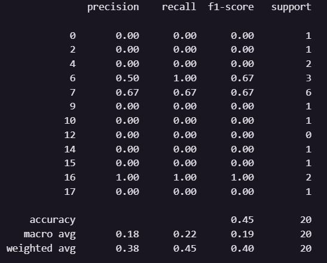
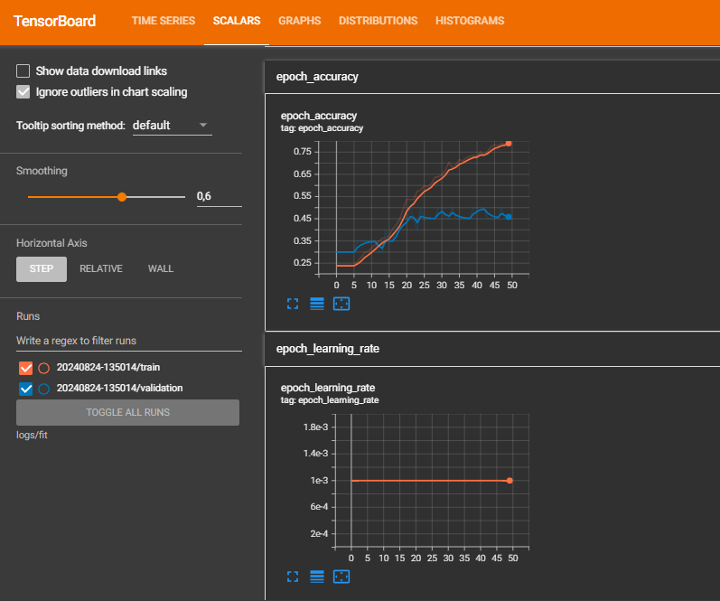
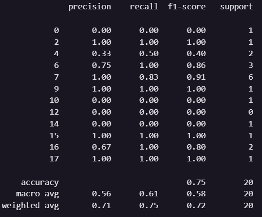
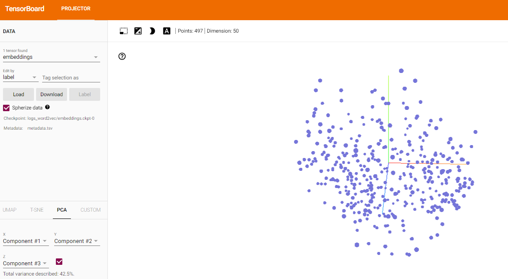
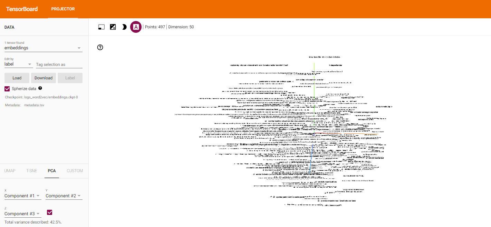

# Desafio-NLU

# 1. Introdução

Feito por Raphael Lisboa, Mateus Almeida, Thomas Barton e Vitor Barros

Nesse repositório é possível encontrar a implementação de uma rede neural, com uma camada de Embedding e utilizando LSTM, para classificações de intenções das frases da base de dados do projeto. Além disso, uma abordagem de Word2Vec pré-treinado com cbow50. Os resultados podem ser vistos através do Tensorboard

## 2. Rede Neural

### 2.1 Métricas de desempenho

Através dos resultados da imagem, podemos concluir que o modelo responde a predição com uma acurácia de 45%, para os casos em que o resultado da predição de alguns labels que se encontra como 0%, podemos concluir que possivelmente esses labels não estavam na partição de teste do dataset, desta forma não foi possível predizê-las

### 2.2 Gráficos do Tensorboard

Vemos por meio do gráfico que mostra a acurácia ao longo das épocas um aumento consideravel na fase de treinamento e uma estagnação bem cedo na hora de teste, o que indicaria um possível overfitting

## 3. Word 2 Vec

### 3.1 Métricas de desempenho

Diferente da Rede Neural, o Word2Vec respondeu de forma mais acurada com 75%. Porém assim como a rede neural, ele também acabou sofrendo com a falta de exemplos de todas as labels no dataset de teste

### 3.2 Representação no tensorboard

Se pusermos as frases em uma representação num plano cartesiano de forma que pudermos ver quais são as frases que apresentam as maiores similaridades, por meio de cálculos como a similaridade de cosseno, obteriamos o seguinte resultado, em que pontos próximos no espaço representam frases de alta similaridade

É possível ver o mesmo gráfico ao clicar no botão "Enable/Disable 3D labels mode" representado como um quadrado com a letra A, dessa forma é possível visualizar as próprias palavras

## 4. Visualização do Notebook

Apesar do código se encontrar nesse repositório, a visualização dos tensorboards acabaram não ficando salvas ao baixar o .ipynb, logo é altamente recomendado ver através do colab: https://colab.research.google.com/drive/1WXqfdLlvxXZXp41e-9Va5xNdUpX2wthR?pli=1&authuser=5